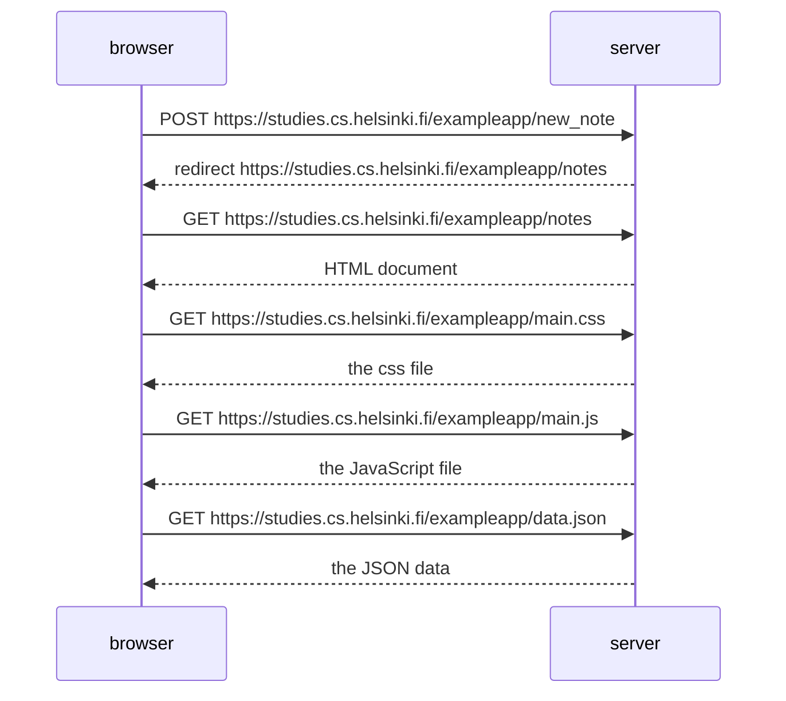

```mermaid
sequenceDiagram

    participant browser
    participant server
    
    browser->>server: POST https://studies.cs.helsinki.fi/exampleapp/new_note
    server-->>browser: redirect https://studies.cs.helsinki.fi/exampleapp/notes

    browser->>server: GET https://studies.cs.helsinki.fi/exampleapp/notes
    server-->>browser: HTML document

    browser->>server: GET https://studies.cs.helsinki.fi/exampleapp/main.css
    server-->>browser: the css file
    
    browser->>server: GET https://studies.cs.helsinki.fi/exampleapp/main.js
    server-->>browser: the JavaScript file
    
    browser->>server: GET https://studies.cs.helsinki.fi/exampleapp/data.json
    server-->>browser: the JSON data  
```

  